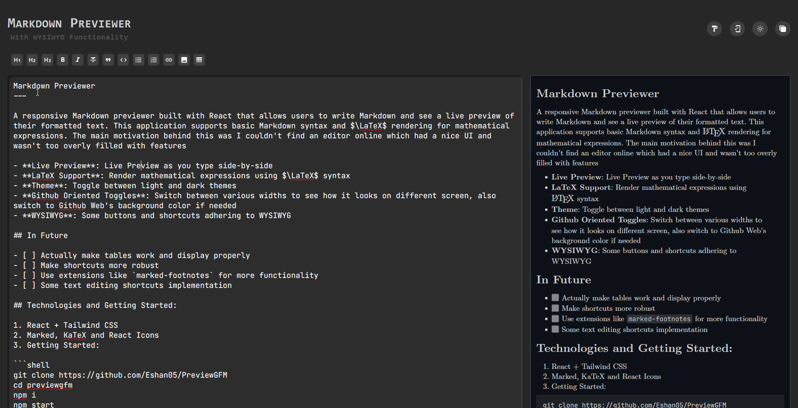

# Markdown Previewer



A responsive Markdown previewer built with React that allows users to write Markdown and see a live preview of their formatted text. This application supports basic Markdown syntax and $\LaTeX$ rendering for mathematical expressions. The main motivation behind this was I couldn't find an editor online which had a nice UI and wasn't too overly filled with features

- **🌟 Live Preview**: Live Preview as you type side-by-side
- **🔢 LaTeX Support**: Render mathematical expressions using $\LaTeX$ syntax
- **🌗 Theme**: Toggle between light and dark themes
- **🖥️ Github Oriented Toggles**: Switch between various widths to see how it looks on different screen, also switch to Github Web's background color if needed
- **✍️ WYSIWYG**: Some buttons and shortcuts adhering to WYSIWYG

## In Future

- [ ] Actually make tables work and display properly
- [ ] Make shortcuts more robust
- [ ] Use extensions like `marked-footnotes` for more functionality
- [ ] Some text editing shortcuts implementation

## Technologies and Getting Started: 

1. React + Tailwind CSS
2. Marked, KaTeX and React Icons
3. Getting Started:

```shell
git clone https://github.com/Eshan05/PreviewGFM
cd previewgfm
npm i
npm start
# Or any other manager
```

---

Contributions are welcomed.